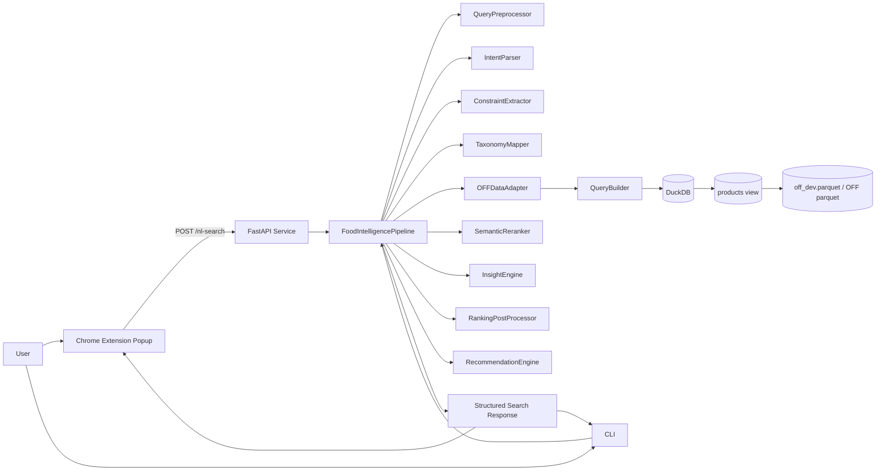
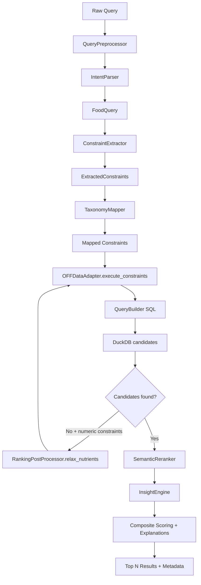

# OFF AI Search - Full Prototype Document

## 1. Prototype Summary

### Project Name
OFF AI Search (Open Food Facts Natural-Language Search)

### Purpose
Build an end-to-end prototype that lets users search food products in plain language (English/French), maps the intent to structured nutrition/category/dietary filters, executes fast local search on Open Food Facts data using DuckDB, and returns ranked results with explanations.

### What was delivered
- Natural-language parser for food intents (category, nutrients, dietary tags, exclusions)
- EN/FR preprocessing and normalization (with optional FR->EN model translation fallback path)
- Constraint extraction + taxonomy mapping to OFF tags
- SQL generation and execution on local Parquet data via DuckDB
- Semantic reranking (embedding-based with lexical fallback)
- Health-aware post ranking and transparent explanations
- Controlled, numeric-only relaxation when exact matches are unavailable
- FastAPI service with `/nl-search`, `/`, and `/health`
- Chrome extension popup UI for interactive search
- CLI entrypoint for local usage
- Dataset tooling for curated Canada-only development parquet
- Unit and behavior test coverage across parser, mapping, pipeline, ranking, and bilingual consistency

## 2. Scope and Product Goals

### Functional goals
- Accept natural language queries such as:
  - `high protein snack`
  - `gluten free cookies`
  - `give a snack which has no palm oil`
  - `cereales faibles en sucre`
- Return relevant products with:
  - interpreted query
  - applied filters
  - ranking rationale
  - optional relaxation notes
  - performance timing

### Non-functional goals
- Fast local execution with DuckDB over Parquet
- Clear/traceable behavior (no hidden black-box filtering)
- Robust fallback behavior when optional model features are unavailable
- Easy local setup and reproducible development dataset

## 3. Technology Stack

### Backend
- Python 3.10+
- FastAPI + Pydantic
- DuckDB (local analytical query engine)
- Parquet dataset (Open Food Facts based)

### ML/NLP utilities
- Rule-based intent parsing and normalization
- Optional sentence-transformers semantic reranking
  - Model default: `all-MiniLM-L6-v2`
- Optional Groq-based FR->EN translation hook

### Frontend
- Chrome Extension (Manifest V3)
- Vanilla HTML/CSS/JS popup client

### Testing
- pytest-based unit/behavior tests

## 4. High-Level Architecture



## 5. Internal Pipeline Architecture



## 6. Component Breakdown

### API layer
- `src/off_ai/api.py`
- Exposes:
  - `GET /` service and dataset status
  - `GET /health` dataset availability and row count
  - `POST /nl-search` natural language search endpoint
- Returns standardized payload:
  - `query`, `interpreted_query`, `applied_filters`, `generated_sql`, `ranking_rationale`, `relaxation`, `performance`, `products`

### Orchestration layer
- `src/off_ai/pipeline.py`
- Main workflow owner:
  - preprocess -> parse -> extract -> taxonomy map -> execute SQL -> relax (if needed) -> semantic rerank -> health/ranking explanation
- Tracks timing metrics (`preprocess_ms`, `parse_ms`, `duckdb_execution_ms`, `ranking_ms`, `total_ms`)
- Keeps executed constraints and returned rationale aligned

### NLP and intent understanding
- `src/off_ai/query_preprocessor.py`
  - lightweight FR detection
  - FR token normalization to canonical EN search vocabulary
  - optional Groq translation path via environment config
- `src/off_ai/intent_parser.py`
  - rule-driven parser
  - extracts category, dietary tags, numeric constraints, exclusions, ranking preferences, search terms
  - supports qualitative phrases (e.g., low sugar, high protein)
- `src/off_ai/constraint_extractor.py`
  - converts `FoodQuery` into normalized constraint object used by query builder

### Taxonomy alignment
- `src/off_ai/taxonomy_mapper.py`
- Maps user categories to OFF taxonomy tags (e.g., `snacks` -> `en:salty-snacks`, `cookies` -> `en:cookies`)

### Data access and SQL generation
- `src/off_ai/data_adapter.py`
  - resolves dataset path from explicit path/env/default candidates
  - creates DuckDB `products` view from Parquet
  - schema-aware field resolution and normalization
  - executes SQL and converts rows to normalized `Product`
- `src/off_ai/query_builder.py`
  - builds parameterized SQL WHERE clauses for category/tags/nutrients/exclusions/keywords
  - applies ordering strategy based on nutriscore, nova, nutrient heuristics, and popularity

### Ranking, reasoning, and recommendations
- `src/off_ai/semantic_reranker.py`
  - computes semantic similarity scores for candidates
  - embedding model if available; lexical overlap fallback otherwise
- `src/off_ai/insight_engine.py`
  - computes health classification and risk/positive indicators
- `src/off_ai/post_processor.py`
  - deterministic numeric relaxation policy
  - ranking rationale builder
- `src/off_ai/recommendation_engine.py`
  - alternative recommendation logic for comparison-mode workflows

### User interaction surfaces
- CLI: `src/off_ai/cli.py`, `src/off_ai/__main__.py`
- API launcher: `run_api.py`
- Chrome extension:
  - `extension/manifest.json`
  - `extension/popup/popup.html`
  - `extension/popup/popup.js`
  - `extension/popup/popup.css`

## 7. Dataset and Storage Strategy

### Primary dataset pattern
- Local Parquet source consumed by DuckDB
- Default expected file: `off_dev.parquet`
- Optional override via `OFF_PARQUET_PATH`

### Curated development dataset
- `download_dataset.py`
- Produces Canada-focused subset (default 50,000 rows)
- Keeps search-relevant schema fields for speed and lower footprint

### Offline synthetic fallback
- `create_dev_dataset.py`
- Generates realistic synthetic local dataset when internet is unavailable

### Runtime relation model
- DuckDB initializes a `products` view from Parquet and queries this relation

## 8. Query Understanding and Constraint Semantics

### Supported intent categories
- Category targeting (snacks, cereals, cookies, chips, soups, etc.)
- Dietary labels (vegan, vegetarian, gluten-free, organic, dairy-free, etc.)
- Numeric nutrient constraints (e.g., `under 300 calories`, `>= 10g protein`)
- Ingredient exclusions (e.g., no palm oil)
- Ranking preferences (healthy, kids)

### Bilingual behavior
- FR queries are normalized into canonical EN terms before parsing
- Pipeline can merge deterministic and translated parses to preserve strongest constraints
- Tests validate EN/FR consistency for representative query pairs

## 9. Ranking and Relaxation Strategy

### Candidate retrieval
- SQL returns top candidate pool (default up to 50) satisfying constraints

### Relaxation policy
- Triggered only when no products are found and numeric constraints exist
- Numeric-only relaxation (semantic constraints preserved):
  - calories upper bound: +50 per pass
  - other upper bounds: +15%
  - protein/fiber lower bounds: -2
  - other lower bounds: -10%
- Logs each adjustment transparently

### Final scoring signals
- Composite recommendation score baseline
- Semantic similarity contribution
- Nutri-Score bonus
- Category and dietary match boosts
- Constraint satisfaction + headroom bonus
- Penalties for violated constraints and category-specific high-sugar behavior
- Preference-aware boosts (`healthy`, `kids`)

## 10. API Contract (Prototype)

### Request
`POST /nl-search`

```json
{
  "query": "gluten free cookies",
  "max_results": 10
}
```

### Response structure
```json
{
  "query": "gluten free cookies",
  "interpreted_query": {},
  "applied_filters": [],
  "generated_sql": "...",
  "ranking_rationale": [],
  "relaxation": [],
  "performance": {
    "preprocess_ms": 0.0,
    "parse_ms": 0.0,
    "duckdb_execution_ms": 0.0,
    "ranking_ms": 0.0,
    "total_ms": 0.0,
    "results_returned": 0,
    "candidate_rows": 0
  },
  "products": []
}
```

## 11. Testing and Quality Coverage

### Test suite focus
- Parsing and intent extraction
- Query preprocessing and bilingual consistency
- Constraint layering and taxonomy mapping
- Data adapter behavior
- Pipeline ranking and relaxation safety
- Recommendation/insight behavior

### Representative test modules
- `tests/test_intent_parser.py`
- `tests/test_query_preprocessor.py`
- `tests/test_constraint_layers.py`
- `tests/test_data_adapter.py`
- `tests/test_pipeline_ranking.py`
- `tests/test_pipeline_relaxation.py`
- `tests/test_bilingual_consistency.py`
- `tests/test_insight_engine.py`
- `tests/test_recommendation_engine.py`

## 12. How to Run the Prototype

### Install
1. Create and activate virtual environment
2. Install dependencies: `pip install -r requirements.txt`

### Prepare data
- Preferred: `python download_dataset.py`
- Offline fallback: `python create_dev_dataset.py`

### Start backend
- `python run_api.py`
- Swagger docs: `http://localhost:8000/docs`

### Use interfaces
- CLI example: `python -m off_ai "high protein snack"`
- Extension: load `extension/` as unpacked extension in Chrome

## 13. What This Prototype Demonstrates

- A complete local-first AI-ish search stack (without requiring a full hosted vector DB)
- Practical NL-to-structured-query conversion for domain-specific search
- Explainable ranking and transparent fallback behavior
- Real integration surface: API + UI extension + CLI
- Bilingual query support tuned for EN/FR food-search intents

## 14. Current Limitations

- Parser is rule-driven; free-form edge cases may need more patterns
- Semantic reranker quality depends on model availability/resources
- Taxonomy mapping is curated and can be expanded for broader OFF categories
- Relaxation currently bounded to deterministic numeric passes
- API persistence/caching and production hardening are prototype-level

## 15. Next Iteration Recommendations

1. Add hybrid lexical+embedding retrieval before SQL narrowing for recall improvements
2. Expand taxonomy mapper with dynamic OFF taxonomy import/sync
3. Add user feedback loop for result relevance tuning
4. Add richer explainability blocks (constraint pass/fail per product)
5. Introduce integration tests for extension<->API contract
6. Add production packaging (containerization, env profiles, CI quality gates)

---

This document captures the implemented prototype as of the current repository state, including architecture, flow, modules, data strategy, and operational behavior.
